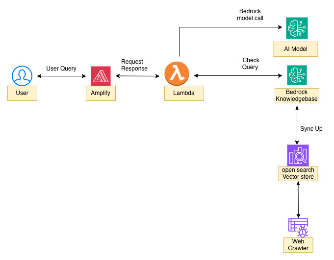

# ReSpawn - Adaptive Gaming ChatBot

A comprehensive AI-powered chatbot application that provides intelligent guidance and support for adaptive gaming in therapy and rehabilitation settings, powered by AWS Bedrock Knowledge Base and cutting-edge AI technologies.

## Disclaimers
Customers are responsible for making their own independent assessment of the information in this document.

This document:

(a) is for informational purposes only,

(b) references AWS product offerings and practices, which are subject to change without notice,

(c) does not create any commitments or assurances from AWS and its affiliates, suppliers or licensors. AWS products or services are provided "as is" without warranties, representations, or conditions of any kind, whether express or implied. The responsibilities and liabilities of AWS to its customers are controlled by AWS agreements, and this document is not part of, nor does it modify, any agreement between AWS and its customers, and

(d) is not to be considered a recommendation or viewpoint of AWS.

Additionally, you are solely responsible for testing, security and optimizing all code and assets on GitHub repo, and all such code and assets should be considered:

(a) as-is and without warranties or representations of any kind,

(b) not suitable for production environments, or on production or other critical data, and

(c) to include shortcuts in order to support rapid prototyping such as, but not limited to, relaxed authentication and authorization and a lack of strict adherence to security best practices.

All work produced is open source. More information can be found in the GitHub repo.

## Index

- [Overview](#overview)
- [Architecture](#architecture)
- [Key Features](#key-features)
- [Technology Stack](#technology-stack)
- [Prerequisites](#prerequisites)
- [Local Development](#local-development)
- [Deployment](#deployment)
- [Post-Deployment Setup](#post-deployment-setup)
- [Usage](#usage)
- [Infrastructure](#infrastructure)
- [Project Structure](#project-structure)
- [Configuration](#configuration)
- [Troubleshooting](#troubleshooting)
- [Credits](#credits)
- [License](#license)

## Overview

ReSpawn is an intelligent chatbot designed to assist therapists, rehabilitation specialists, and healthcare professionals in implementing adaptive gaming solutions for patients with physical limitations. The application combines natural language processing with AWS Bedrock Knowledge Base to deliver accurate, context-aware responses in both English and Spanish.

Built on a serverless architecture with real-time streaming communication, secure knowledge base integration, and an intuitive chat interface, ReSpawn makes adaptive gaming guidance accessible and actionable.

## Live Demo

Watch the full walkthrough of ReSpawn – Adaptive Gaming ChatBot in action:

**Demo Video:**

[documents/Respawn-Demo.mp4](https://github.com/ASUCICREPO/Respawn-Chatbot-Latest/blob/main/documents/Respawn-Demo.mp4)

### Key Features

- **Multi-Language Support**: Seamless English and Spanish conversation with automatic language detection
- **AWS Bedrock Knowledge Base Integration**: Powered by Amazon Nova Lite and Titan embeddings for intelligent responses
- **Real-time Streaming Responses**: Server-sent events (SSE) for smooth, progressive answer delivery
- **Contextual Conversation Memory**: Maintains conversation history across sessions for coherent multi-turn dialogues
- **Intelligent FAQ System**: Pre-loaded with 10 common adaptive gaming questions in both languages
- **Web Crawler Data Source**: Automatically ingests and indexes content from specified URLs
- **Responsive Chat Interface**: Modern Next.js frontend with floating chat widget
- **Serverless Architecture**: Fully managed AWS infrastructure with API Gateway, Lambda, and OpenSearch Serverless

## Architecture



The application implements a serverless, event-driven architecture with AWS Bedrock at its core:

### Core Components

1. **Frontend (Next.js + React + TypeScript)**
   - Responsive chat widget with floating button interface
   - Real-time streaming message display
   - Language toggle (EN/ES)
   - FAQ sidebar with collapsible panel
   - Conversation state management

2. **Backend (AWS Lambda + Python)**
   - RESTful API endpoints (`/api/chat`, `/health`)
   - Bedrock Agent Runtime integration
   - Conversation session management
   - Language-aware prompt engineering

3. **Knowledge Base (AWS Bedrock + OpenSearch Serverless)**
   - Vector embeddings using Amazon Titan
   - Web crawler data source for content ingestion
   - Semantic search and retrieval
   - RAG (Retrieval Augmented Generation) pipeline

4. **Infrastructure (AWS CDK + TypeScript)**
   - Infrastructure as Code for reproducible deployments
   - API Gateway HTTP API with CORS support
   - CloudWatch Logs for monitoring
   - AWS Amplify for frontend hosting

### Data Flow

1. User submits a question through the chat interface
2. Frontend sends POST request to API Gateway `/api/chat` endpoint
3. Lambda function receives request and calls Bedrock Agent Runtime
4. Bedrock retrieves relevant context from Knowledge Base (OpenSearch Serverless)
5. LLM generates response using retrieved context and conversation history
6. Response streams back to frontend via Server-Sent Events (SSE)
7. Chat widget displays formatted response with suggestions

## Technology Stack

### Frontend
- **Framework**: Next.js 16.1.6 (React 19.2.3)
- **Language**: TypeScript 5
- **Styling**: Tailwind CSS 4
- **Build Tool**: Vite
- **Deployment**: AWS Amplify Hosting

### Backend
- **Runtime**: Python 3.11
- **Framework**: AWS Lambda
- **API**: API Gateway HTTP API
- **AI/ML**: AWS Bedrock (Nova Lite, Titan Embeddings)
- **Vector Store**: OpenSearch Serverless

### Infrastructure
- **IaC**: AWS CDK 2.175.0
- **Language**: TypeScript
- **Services**: Lambda, API Gateway, Bedrock, OpenSearch Serverless, Amplify, CloudWatch

## Prerequisites

Before deploying or running locally, ensure you have:

### Required Tools
- **Node.js**: v20 or higher
- **Python**: 3.11 or higher
- **AWS CLI**: v2.x configured with valid credentials
- **AWS CDK**: v2.175.0 or higher
- **Git**: For version control

### AWS Account Requirements
- Active AWS account with appropriate permissions
- Bedrock model access enabled for:
  - `amazon.nova-lite-v1:0` (or your chosen LLM)
  - `amazon.titan-embed-text-v2:0` (for embeddings)
- IAM permissions for:
  - Lambda, API Gateway, Bedrock, OpenSearch Serverless
  - CloudWatch Logs, IAM roles
  - Amplify (for frontend hosting)

### GitHub Requirements
- GitHub account
- Personal Access Token with `repo` scope (for Amplify deployment)

## Local Development

### Backend Setup

1. Navigate to the backend directory:
```bash
cd backend
```

2. Create and activate a virtual environment:
```bash
python3 -m venv .venv
source .venv/bin/activate  # On Windows: .venv\Scripts\activate
```

3. Install dependencies:
```bash
pip install -r requirements.txt
```

4. Configure environment variables (copy from `env.example`):
```bash
cp env.example .env
```

Edit `.env` with your values:
```env
PORT=8000
CORS_ORIGIN=http://localhost:3000
BEDROCK_KB_ID=your-kb-id
BEDROCK_MODEL_ID=amazon.nova-lite-v1:0
```

5. Run the development server:
```bash
uvicorn app.main:app --reload --port 8000
```

The backend will be available at `http://localhost:8000`

### Frontend Setup

1. Navigate to the frontend directory:
```bash
cd frontend
```

2. Install dependencies:
```bash
npm install
```

3. Configure environment variables:
```bash
# Create .env.local file
echo "NEXT_PUBLIC_API_URL=http://localhost:8000" > .env.local
```

4. Run the development server:
```bash
npm run dev
```

The frontend will be available at `http://localhost:3000`

### Testing Locally

1. Open `http://localhost:3000` in your browser
2. Click the floating chat button (bottom-right)
3. Select a language (EN/ES)
4. Try an FAQ question or type your own
5. Verify responses stream correctly

## Deployment

### Step 1: Prepare AWS Credentials

**Option A: AWS SSO (Recommended)**
```bash
aws sso login --profile your-profile-name
export AWS_PROFILE=your-profile-name
```

**Option B: AWS Configure**
```bash
aws configure
# Enter your Access Key ID and Secret Access Key
```

### Step 2: Bootstrap CDK (One-time per account/region)

```bash
cd infrastructure/cdk
npm install

# Bootstrap CDK (replace with your account ID)
npx cdk bootstrap aws://YOUR_ACCOUNT_ID/us-east-1
```

### Step 3: Prepare Deployment Parameters

You'll need:
1. **Web Crawler Seed URLs**: Comma-separated list of URLs to crawl for knowledge base content
2. **GitHub Repository URL**: `https://github.com/ASUCICREPO/Respawn--Adaptive-Gaming-ChatBot`
3. **GitHub Personal Access Token**: Create at https://github.com/settings/tokens
   - Required scopes: `repo`
4. **Branch Name**: `main` (or your deployment branch)

### Step 4: Deploy Infrastructure

```bash
cd infrastructure/cdk

npx cdk deploy \
  --parameters WebCrawlSeedUrls="https://example.com,https://docs.example.com" \
  --parameters AmplifyRepository="https://github.com/ASUCICREPO/Respawn--Adaptive-Gaming-ChatBot" \
  --parameters AmplifyOauthToken="YOUR_GITHUB_TOKEN" \
  --parameters AmplifyBranch="main" \
  --require-approval never
```

### Step 5: Note Deployment Outputs

After successful deployment, CDK will output:
- `HttpApiUrl`: Your API Gateway endpoint (e.g., `https://abc123.execute-api.us-east-1.amazonaws.com`)
- `KnowledgeBaseId`: Bedrock Knowledge Base ID
- `OpenSearchCollectionName`: OpenSearch Serverless collection name
- `AmplifyAppId`: Amplify application ID

## Post-Deployment Setup

### 1. Enable Bedrock Model Access

1. Go to AWS Console → Amazon Bedrock → Model access
2. Click "Manage model access"
3. Enable the following models:
   - `Amazon Nova Lite` (for chat responses)
   - `Titan Embeddings G1 - Text v2` (for vector embeddings)
4. Wait for access to be granted (usually instant)

### 2. Sync Knowledge Base Content

Trigger the web crawler to ingest content:

```bash
# Get the data source ID
aws bedrock-agent list-data-sources \
  --knowledge-base-id <KnowledgeBaseId-from-output> \
  --region us-east-1

# Start ingestion job
aws bedrock-agent start-ingestion-job \
  --knowledge-base-id <KnowledgeBaseId> \
  --data-source-id <DataSourceId-from-list> \
  --region us-east-1
```

Monitor ingestion progress:
```bash
aws bedrock-agent list-ingestion-jobs \
  --knowledge-base-id <KnowledgeBaseId> \
  --data-source-id <DataSourceId> \
  --region us-east-1
```

### 3. Verify Amplify Deployment

1. Go to AWS Console → AWS Amplify
2. Find your app: `adaptive-gaming-guide`
3. Check build status (should be "Deployed")
4. Click the deployment URL to access your live application

### 4. Test the Deployment

1. Open the Amplify app URL
2. Click the chat button
3. Ask a test question
4. Verify:
   - Response streams correctly
   - Language toggle works
   - FAQ questions load
   - Conversation history persists

## Usage

### Chat Interface

1. **Open Chat**: Click the floating chat button (bottom-right corner)
2. **Select Language**: Toggle between EN (English) and ES (Spanish)
3. **Ask Questions**: 
   - Click an FAQ question from the sidebar
   - Type your own question in the input field
4. **View Responses**: Responses stream in real-time with formatted sections:
   - Summary
   - Recommendations
   - Next questions (clickable suggestions)
5. **Continue Conversation**: Ask follow-up questions to maintain context
6. **Clear Chat**: Click the refresh icon to start a new conversation

### API Endpoints

#### POST /api/chat
Send a chat message and receive a response.

**Request:**
```json
{
  "message": "What games work best for patients with limited mobility?",
  "conversationId": "optional-session-id",
  "language": "en"
}
```

**Response:**
```json
{
  "conversationId": "session-id",
  "reply": "Summary:\n- Games with customizable controls...\n\nRecommendations:\n- Try turn-based strategy games..."
}
```

#### GET /health
Health check endpoint.

**Response:**
```json
{
  "ok": true
}
```

#### GET /
API information endpoint.

**Response:**
```json
{
  "ok": true,
  "message": "Adaptive Gaming Guide API",
  "routes": {
    "health": {"method": "GET", "path": "/health"},
    "chat": {"method": "POST", "path": "/api/chat"}
  }
}
```

## Infrastructure

### AWS Services Used

| Service | Purpose | Configuration |
|---------|---------|---------------|
| **API Gateway** | HTTP API for frontend-backend communication | CORS enabled, CloudWatch logging |
| **Lambda** | Serverless compute for chat logic | Python 3.11, 1024MB memory, 30s timeout |
| **Bedrock** | AI/ML foundation models | Nova Lite (LLM), Titan Embeddings |
| **OpenSearch Serverless** | Vector database for embeddings | VECTORSEARCH collection, public access |
| **Amplify** | Frontend hosting and CI/CD | Auto-build on push, environment variables |
| **CloudWatch** | Logging and monitoring | 7-day retention for API and Lambda logs |
| **IAM** | Access control | Least-privilege roles for Lambda and Bedrock |

### Cost Considerations

- **Lambda**: Pay per request and compute time
- **API Gateway**: Pay per million requests
- **Bedrock**: Pay per input/output tokens
- **OpenSearch Serverless**: Pay per OCU (OpenSearch Compute Unit)
- **Amplify**: Pay per build minute and data transfer

Estimated monthly cost for moderate usage: $50-$150

### Security

- **API Gateway**: CORS configured for secure cross-origin requests
- **Lambda**: Execution role with minimal required permissions
- **Bedrock**: IAM-based access control
- **OpenSearch**: Network and encryption policies enforced
- **Secrets**: GitHub token stored securely in CloudFormation parameters (NoEcho)

## Project Structure

```
.
├── frontend/                    # Next.js frontend application
│   ├── src/
│   │   ├── app/                # Next.js app router pages
│   │   ├── components/         # React components
│   │   │   └── chat/          # Chat widget component
│   │   └── types/             # TypeScript type definitions
│   ├── public/                # Static assets
│   │   ├── frontpage.jpg      # Landing page image
│   │   └── ReSpawn_logo.png   # Brand logo
│   ├── package.json
│   └── tsconfig.json
│
├── backend/                     # Python backend (for local dev)
│   ├── app/
│   │   └── main.py            # FastAPI application
│   ├── requirements.txt
│   └── env.example
│
├── infrastructure/              # AWS CDK infrastructure
│   └── cdk/
│       ├── bin/
│       │   └── app.ts         # CDK app entry point
│       ├── lib/
│       │   └── adaptive-gaming-chatbot-stack.ts  # Main stack
│       ├── lambda/
│       │   └── ai-agent/      # Lambda function code
│       │       ├── handler.py
│       │       └── requirements.txt
│       ├── cdk.json
│       └── package.json
│
├── amplify.yml                  # Amplify build specification
├── documents/                   # Documentation assets
│   ├── AdaptiveGamingBotArc.jpg # Architecture diagram
│   └── Respawn Demo.mov         # Demo video
├── README.md
└── .gitignore
```

## Configuration

### Environment Variables

#### Frontend (.env.local)
```env
NEXT_PUBLIC_API_URL=https://your-api-gateway-url.execute-api.us-east-1.amazonaws.com
```

#### Backend (.env - for local development)
```env
PORT=8000
CORS_ORIGIN=http://localhost:3000
BEDROCK_KB_ID=your-knowledge-base-id
BEDROCK_MODEL_ID=amazon.nova-lite-v1:0
BEDROCK_MODEL_ARN=  # Optional override
```

#### Lambda (Set by CDK)
- `BEDROCK_KB_ID`: Knowledge Base ID
- `BEDROCK_MODEL_ID`: Model identifier
- `BEDROCK_MODEL_ARN`: Optional model ARN override
- `AWS_REGION`: Deployment region

### CDK Context (cdk.json)
```json
{
  "bedrockModelId": "amazon.nova-lite-v1:0",
  "embeddingModelArn": "arn:aws:bedrock:us-east-1::foundation-model/amazon.titan-embed-text-v2:0"
}
```

## Troubleshooting

### Common Issues

#### 1. Bedrock Access Denied
**Error**: `AccessDeniedException: Could not access model`

**Solution**: Enable model access in Bedrock console (see Post-Deployment Setup)

#### 2. Knowledge Base Returns No Results
**Error**: Empty or generic responses

**Solution**: 
- Verify ingestion job completed successfully
- Check web crawler seed URLs are accessible
- Ensure OpenSearch index was created

#### 3. CORS Errors in Frontend
**Error**: `Access-Control-Allow-Origin` errors

**Solution**:
- Verify API Gateway CORS configuration
- Check `NEXT_PUBLIC_API_URL` environment variable
- Ensure Amplify environment variables are set

#### 4. Lambda Timeout
**Error**: Task timed out after 30 seconds

**Solution**:
- Increase Lambda timeout in CDK stack
- Optimize Bedrock query parameters
- Check Knowledge Base performance

#### 5. Amplify Build Fails
**Error**: Build fails during deployment

**Solution**:
- Check Amplify build logs
- Verify `amplify.yml` configuration
- Ensure `NEXT_PUBLIC_API_URL` is set in Amplify environment variables

### Debug Commands

```bash
# Check Lambda logs
aws logs tail /aws/lambda/AdaptiveGamingChatbotStack-AiAgentFn --follow

# Check API Gateway logs
aws logs tail /aws/apigateway/AdaptiveGamingChatbotStack-ChatApi --follow

# Test API endpoint
curl -X POST https://your-api-url/api/chat \
  -H "Content-Type: application/json" \
  -d '{"message": "test", "language": "en"}'

# Check Knowledge Base status
aws bedrock-agent get-knowledge-base \
  --knowledge-base-id <your-kb-id> \
  --region us-east-1
```

## Credits

This application was developed by the ASU Cloud Innovation Center team in collaboration with adaptive gaming specialists and healthcare professionals.

**Development Team:**
- Solutions Architects
- Full-Stack Developers
- UX/UI Designers

**Special Thanks:**
- AWS Bedrock team for AI/ML capabilities
- Adaptive gaming community for domain expertise
- Healthcare professionals for requirements and feedback

## License

See [LICENSE](LICENSE) file for details.

---

## Additional Resources

- [AWS Bedrock Documentation](https://docs.aws.amazon.com/bedrock/)
- [AWS CDK Documentation](https://docs.aws.amazon.com/cdk/)
- [Next.js Documentation](https://nextjs.org/docs)
- [AWS Amplify Documentation](https://docs.amplify.aws/)

## Support

For questions, issues, or support:
- **Email**: ai-cic@amazon.com
- **Issues**: [GitHub Issues](https://github.com/ASUCICREPO/Respawn--Adaptive-Gaming-ChatBot/issues)

---

**Built by Arizona State University's AI Cloud Innovation Center (AI CIC)**  
**Powered by AWS**
